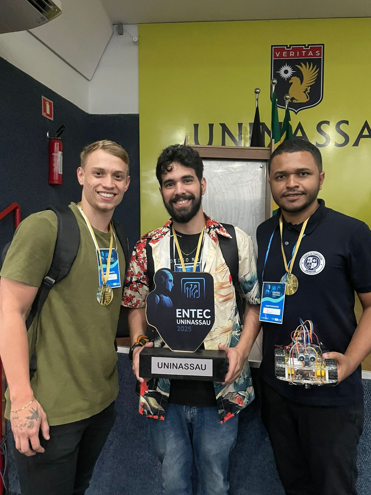
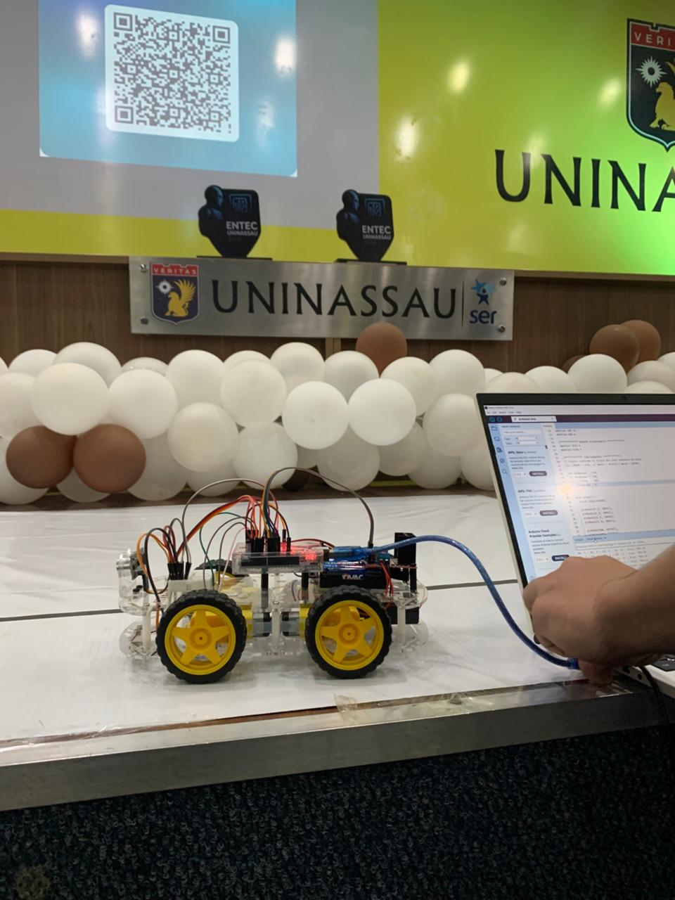
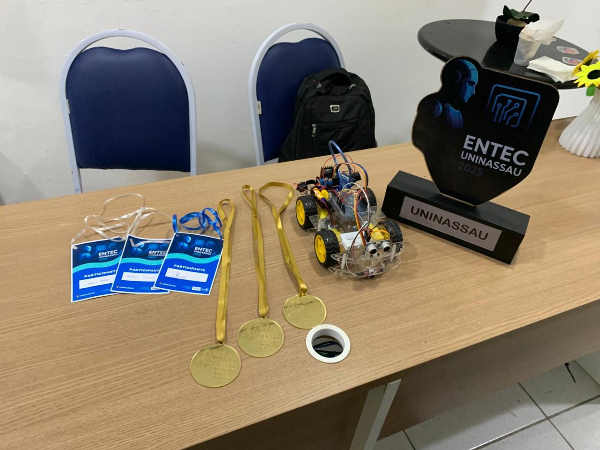

# 🤖 Wall-E — Robô Seguidor de Linha com Desvio de Obstáculos

Projeto desenvolvido para a **13ª edição da ENTEC UNINASSAU**, carinhosamente apelidado de **Wall-E**.  
O robô utiliza sensores infravermelhos para seguir linhas e um sensor ultrassônico para desviar automaticamente de obstáculos.

---

## ⚙️ Funcionalidades

- Segue linha usando **4 sensores IR** (2 frontais e 2 laterais)
- Detecta obstáculos com **sensor ultrassônico**
- Realiza curvas suaves e acentuadas
- Sistema de motores controlado por **ponte H HW-095**
- Velocidades configuráveis
- Lógica robusta para retomada da linha

---

## 🔧 Componentes Utilizados

| Componente | Quantidade |
|-----------|------------|
| Arduino UNO / Nano | 1 |
| Ponte H HW-095 | 1 |
| Motores DC | 2 |
| Sensor Ultrassônico HC-SR04 | 1 |
| Módulo Seguidor de Linha (4 sensores) | 1 |
| Bateria 9–12V | 1 |

---

## 📌 Como Funciona (Resumo)

- Os sensores IR retornam valores analógicos. Se o valor é maior que o **limiar**, considera-se que o sensor está vendo **preto**.
- A lógica verifica:
  - Linha central → anda reto  
  - Linha desviada → curva  
  - Linha lateral → curva acentuada  
  - Obstáculo < 15 cm → parar → desviar  

---

## ▶️ Como rodar

1. Abra o arquivo `carro.ino` no Arduino IDE.
2. Conecte o Arduino.
3. Faça upload.
4. Coloque o robô sobre a pista e divirta-se!

---

## 📜 Licença

Este projeto é distribuído sob a licença **MIT**.  
Você pode usar, modificar e compartilhar à vontade.

---

## 📸 Imagens

| Equipe | Robô | Premiação |
|--------|------|-----------|
|  |  |  |

## 🎥 Vídeos / GIFs

[![Circuito] - Vídeo da Robótica](imagens/ROBOTICA2.mp4)

---

## 🥇 Autores

- | Derick Portela | [@DerickP](https://github.com/DerickxP) |
- | Michael Domingos | [@michaeldomingos](https://github.com/mmichaeldomingos) |
- | Raul Vitor | [@raulvitor](https://github.com/) |
